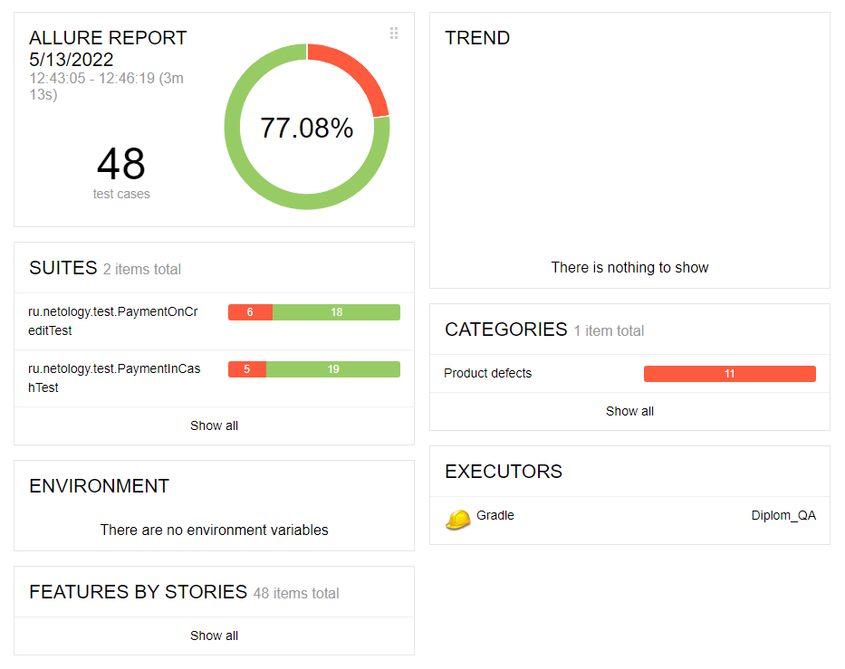

#**Отчёт о проведённом тестировании**
## Краткое описание
 
В ходе дипломного проекта произведена автоматизация тестирования комплексного сервиса, взаимодействующего с СУБД и API Банка. 
Приложение представляло из себя веб-сервис, который предлагал купить тур по определенной цене с помощью двух способов:
    - Обычная оплата по дебетовой карте,
    - Уникальная технология: выдача кредита по данным банковской карты.

## Количество тест-кейсов:

Общее количество тест-кейсов - 48 (8 позитивных, 40 негативных)

* успешных - 37 (77.08%)
* неуспешных - 11 (22,92%)

## Общие рекомендации

В результате тестирования были выявлены и заведены следующие дефекты (issues):

1. [При вводе в поле "Номер карты" 16 нулей отправляется запрос на отправку и выводится сообщение "Ошибка! Банк отказал в проведении операции", при закрытии этого сообщения под ним отображается сообщение "Операция одобрена Банком"](https://github.com/Leiza111/Diplom_QA/issues/1) ;

2. [Одобрение банка при оплате тура картой со статусом "DECLINED"](https://github.com/Leiza111/Diplom_QA/issues/2) ;

3. [Одобрение банка при вводе неполного ФИО владельца](https://github.com/Leiza111/Diplom_QA/issues/3) ;

4. [Одобрение банка при вводе ФИО владельца с маленькой буквы](https://github.com/Leiza111/Diplom_QA/issues/4) ;

5. [Одобрение банка при вводе более 30 символов в поле "Владелец"](https://github.com/Leiza111/Diplom_QA/issues/5) ;

6. [Одобрение банка при вводе латинских букв, спецсимволов в поле "Владелец"](https://github.com/Leiza111/Diplom_QA/issues/6) ;

7. [Одобрение банка при вводе нулевого значения в поле CVC/CVV](https://github.com/Leiza111/Diplom_QA/issues/7) ;

8. [Орфографическая ошибка в названии страны](https://github.com/Leiza111/Diplom_QA/issues/8) .

## Окружение:

* 64-разрядная операционная система, процессор x64,Версия 21H2, Дата установки ‎12.‎03.‎2022, Сборка ОС 19044.1586, Windows 10 Pro.

* Google Chrome - Версия 99.0.4844.74 (Официальная сборка), (64 бит)

* IntelliJ IDEA Ultimate v.2021.3.2